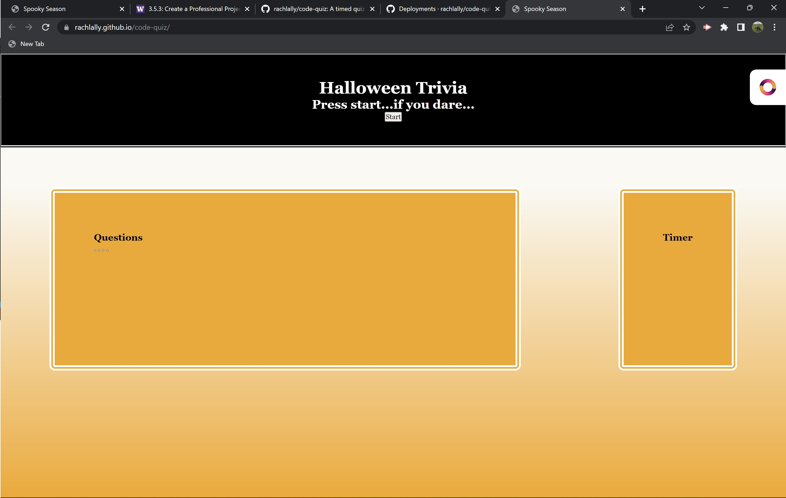

# Code Quiz Halloween Style
A timed quiz on all things Halloween

## Description

The goal was to create a multiple choice quiz with a timer, penalty, and ablity to store final scores.  I built this to get familiar and more comfortable with JavaScript and Web APIs, challenging but key aspects to moving forward as a bootcamp student.  I was able to create readable HTML and CSS to create a user friendly site.  I added JavaScript to make the page interactive, allowing a user to select right or wrong answers and move through the quiz.  I also think people will learn some fun facts.  

I learned a great deal more about JavaScript.  I have a better grasped on event listeners and what purpose they serve.  I learned that I am still figuring out for loops.  

## Usage

The site is viewable at: https://rachlally.github.io/code-quiz/

To begin the quiz, the user will simply press the start button located in the header.  A timer will start counting down.  User must choose an answer from the four listed.  If correct, the next question will appear.  If incorrect, the next question will appear and the timer will deduct 5 seconds.  To reset, user must refresh the page.

## Credits

Huge shout out to my TAs, tutors, and classmates.

## License

MIT License

Copyright (c) 2022 rachlally
